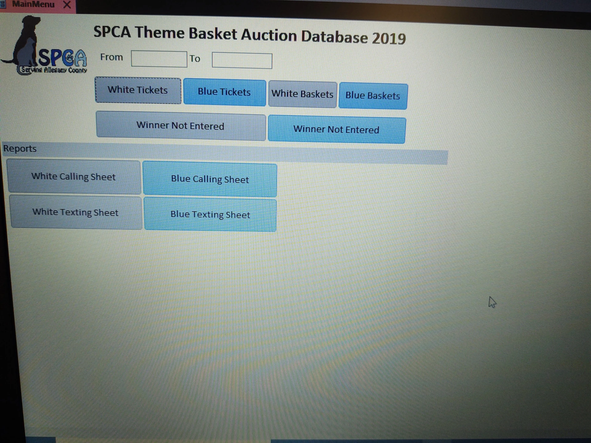
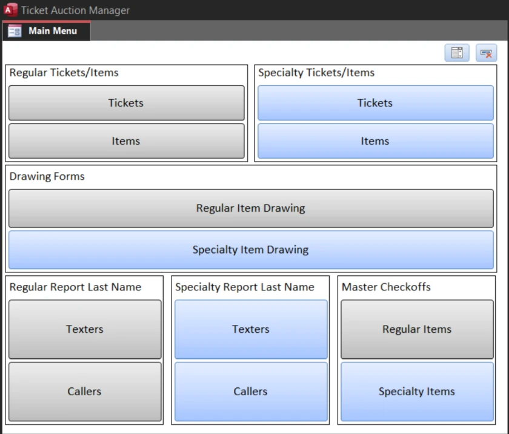
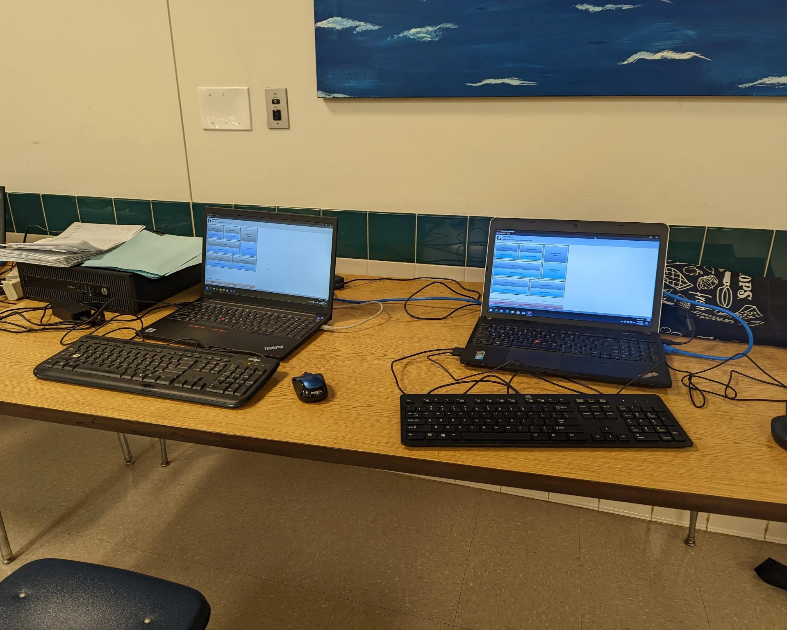
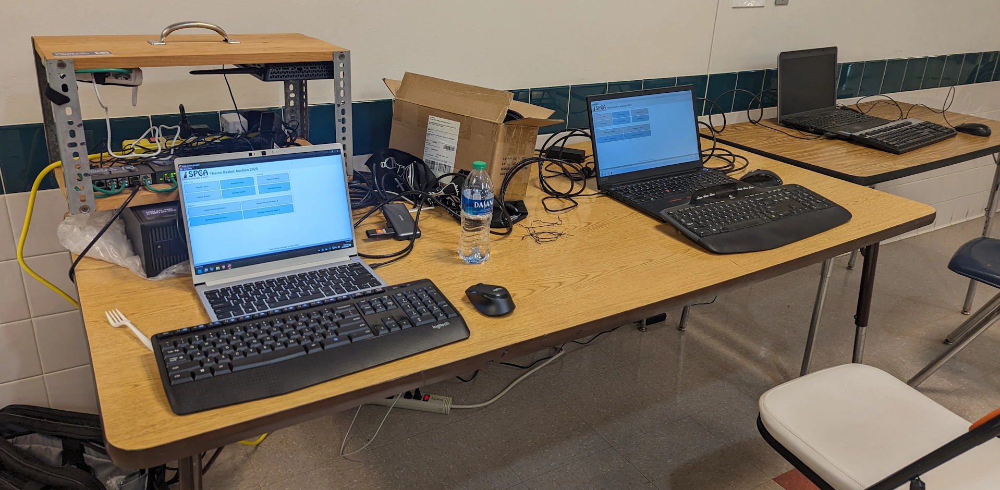
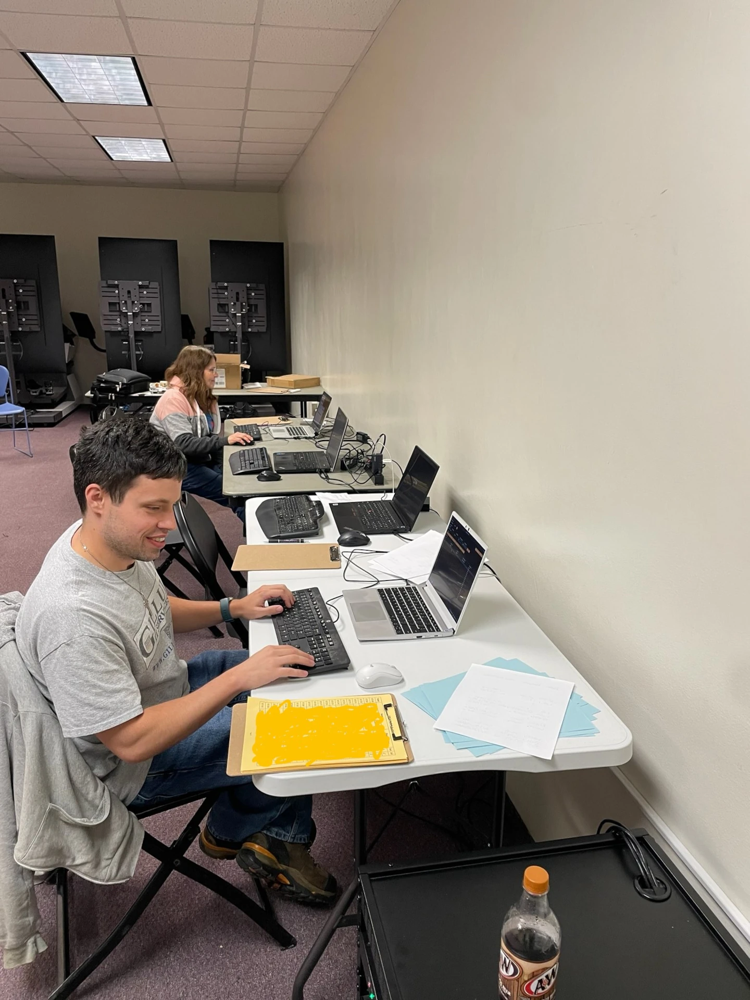
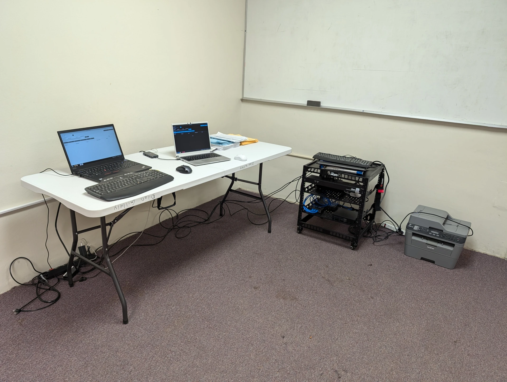

+++
date = '2025-10-22T22:18:00-04:00'
draft = false
title = 'History'
[menus.main]
weight = 2
[params]
color = 'blue'
+++

Ticket Auction Manager started as a project in 2018. It was created by me, Dilan Gilluly, to address some challenges faced by using Excel or paper methods, during the annual SPCA Serving Allegany County Theme Basket Auction.

Its goals were simple:

1. **Offline access**: Internet wasn't always provided by the venue, so it had to be accessible via LAN.
2. **Performance**: It had to perform well enough to not hold up any data entry processes.
3. **Concurrent Access**: At the time we were pushing 6,000 sold tickets so concurrent access with at least two different workstations was a must.

## 2018 Original MS Access attempt

In 2018 I originally tried to use Microsoft Access entirely, because it was a solution I understood well at the time, after having to use it for a five week segment in college.

That burned us in 2018, because each user could not enter data into the same table at the same time. Even cycling through record lock settings wouldn't resolve it. Luckily there were two different tablesets at the time, so one person could just stay in the Regular Tickets table, and another could enter in the Specialty Tickets table.

## 2019 Second MS Access attempt

For the 2019 Theme Basket Auction, I had figured out how to connect Microsoft Access to MariaDB as a backend via ODBC. This was one of the only years where things went flawlessly for the most part.

## 2020 Third MS Access attempt

This was the year Microsoft decided to shoot us in the foot by requiring Access clients to occasionally check into the internet. Because I had prepared the laptops ahead of schedule, a month ahead, Access deactivated on all three workstations for the Saturday part of the event. I had to tether each one to my phone to get internet enough to reactivate Access. The Database Application would not work in a deactivated mode even though it was already in "binary" format.

The link to this version is still hosted on my OneDrive's Public folder to this day. [Which is at this link](https://1drv.ms/f/c/a2a89baef684bdbb/Qru9hPaum6gggKJgCgAAAAAAwYsb6EZHY-c1oQ).

That was when I first started investigating transferring to a self-coded language, like Python.

In May of 2021 I happened to see a Humble Bundle for Python books, so I bought it. And started the process of learning how to code projects from scratch.

Although it wouldn't be for a few more years until I programmed a version entirely in Python.

## 2021 - 2023 The Dark Ages

Each year following I was having to look over my shoulder. 2021 went without a hitch, as I tried signing out and signing back into Office. Then 2022, I did the same thing and it deactivated one of the workstations mid-event again. For 2023, two workstations locked themselves out due to some sort of checkin window with the Microsoft Online account experience.

For the 2023 year, I experimented with racking some of the networking equipment to make it easier to transport it on site. Using the "wooden sandwich" I brought the networking gear. And a separate tower for hosting the Database.

After these I said screw it, let's try Linux.

## 2024 First Year Entirely In Linux

After spending the last few years in Python making a direct to DB version, I realized that it was lacking in performance.

So I learned about API programming. And had been testing it alongside maintaining the Access version. By 2024, overlapping with the time I was fed-up with Microsoft, I decided to give the version in Python, using FastAPI and TTKBootStrap libraries, a go.

And it worked very well. The first night, had four workstations going simultaneously with no problems. Had three going on Saturday. Ran backups every 30 minutes, and wrote on the sheets when they were entered so that I'd know which ones to reenter after restoration if something did go wrong.

I had realized how bad that would be in the thick of it, that after the auction, I decided to program an offline DB as well just so that I could just push the changes to a new server once connected.

Well, I never got to use that in production.

The one thing that I did get into production was the new TecMojo rack and a Dell Optiplex Micro. Which worked flawlessly. I was able to get it on site and back without cracking, unlike the "wooden sandwich" did when I tried to put the Optiplex in it. So now I just have to worry about transporting one thing instead of two or a few.

## 2025 Using TAM3 A SvelteKit based version

Upon going back and forth with Fedora, I realized how much of a pain it is to get a home-coded TCL application to work in Wayland.

So I looked at ways to make webapps. Researched React at first and made a few, much smaller, webapps. It became complicated when I tried to make something like Ticket Auction Manager in it.

Then someone in a reply to one of my comments on a Facebook page community, mentioned Svelte. So I started researching and using Svelte and SvelteKit.

It was SO MUCH EASIER. It's method of binding values to text elements was a piece of cake compared to React's getter and setter method philosophy. Other than the hotkeys, I was able to use just its standard libraries and Drizzle ORM.

Within two weeks of programming, I had most of a framework of a working version of Ticket Auction Manager.

We had no issues with 4 people concurrently going at it at the same time. There were a few things that needed fixing but that was mostly finishing stuff. Backup restoration, main menu refresh (other volunteers had difficulties with the dropdown), and a verification if there were any unsaved records on exit.
